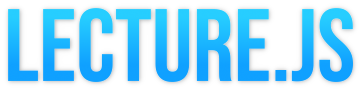

Lecture.js is a tool to convert PDF slides and scripts to spoken video lectures using advanced text-to-speech services from Amazon and Google. It implements a custom XML-based language, the Lecture Synthesis Markup Language (LSML), which supports the integration of PDF slides, controlling the voice and language, embedding of images, audio and video clips, and video quality settings.

# How to use

1. [Installation](/lecture.js/doc/installation.md)
2. [How to use](/lecture.js/doc/how-to-use.md)
3. [Documentation](/lecture.js/doc/README.md)